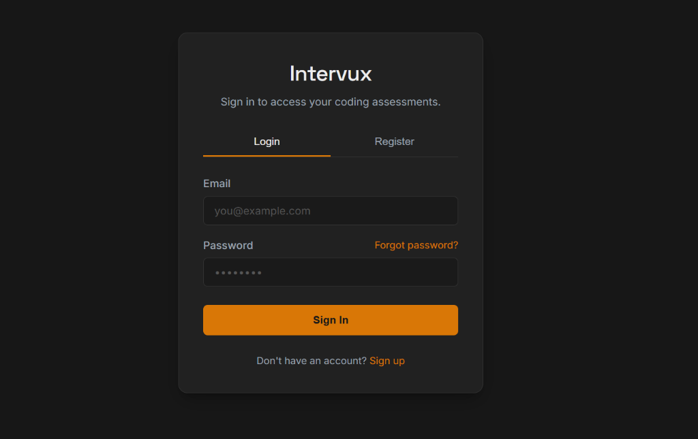
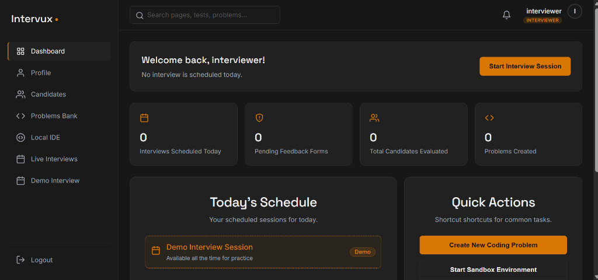
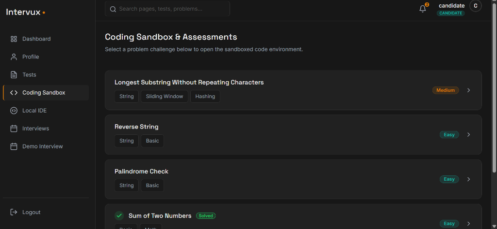
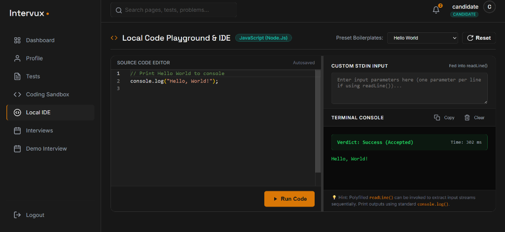
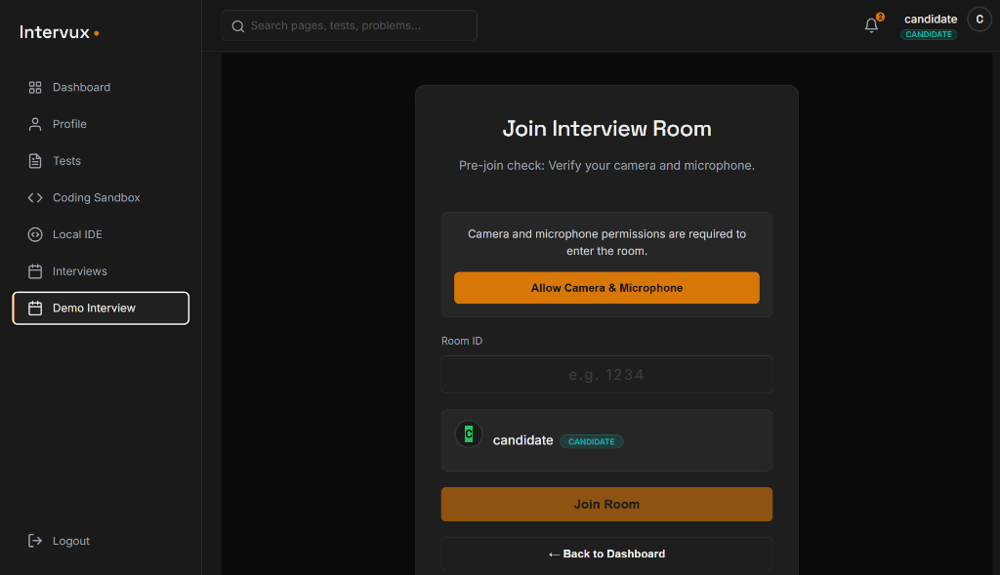

# Intervu-X

A full-stack coding interview and assessment platform — built to bring LeetCode-style problem solving and structured technical interviews into one place. Candidates can solve DSA problems with real-time code execution, attempt MCQ assessments, and track their progress. Interviewers can manage question banks and review candidates. Admins get a full view of platform activity.

🔗 **Live:** [intervu-x.vercel.app](https://intervu-x.vercel.app)


---

## Why I built this

Most interview prep platforms are either too simple (just a code editor with no real grading) or too complex to set up. I wanted to build something that handles the full loop — problem solving, automated judging, and the actual interview/assessment workflow — while learning how production tools like LeetCode and HackerRank handle code execution safely under the hood.

This is also where I went deep on things I hadn't worked with much before: sandboxed code execution with Docker, real-time updates with Socket.io, and WebRTC for live interview sessions.

## Features

- **Role-based access** — separate experiences for Candidate, Interviewer, and Admin, each with their own dashboard and permissions
- **Custom JWT authentication** — secure, cookie-based auth built from scratch (no third-party auth provider)
- **Real-time code execution** — submit code and get judged results (Accepted / Wrong Answer / TLE) with execution time and memory stats
- **DSA problem bank** — browse problems by difficulty and tags, track which ones you've solved
- **MCQ assessments** — timed quizzes as part of the evaluation flow
- **Live interview support** — WebRTC-based video calls with Socket.io for real-time signaling
- **Profile system** — role-specific profile pages (skills/education for candidates, expertise areas for interviewers)
- **Submission history** — track every attempt with verdicts and performance metrics

## Tech Stack

**Frontend:** React, Tailwind CSS, Monaco Editor (the code editor that powers VS Code)

**Backend:** Node.js, Express, MongoDB (Mongoose), Redis (caching/queues), Socket.io (real-time), WebRTC (video)

**Auth:** Custom JWT-based authentication with bcrypt password hashing and Zod for request validation

**Infra:** Docker (sandboxed code execution), deployed on Vercel

## Project Structure

```
Intervu-X/
├── backend/          # Express API, auth, controllers, models
├── frontend/         # React app, UI components, pages
├── package.json
└── README.md
```

## Getting Started

### Prerequisites
- Node.js (v18+)
- MongoDB instance (local or Atlas)
- Redis instance (local or hosted)

### Setup

1. Clone the repo
```bash
git clone https://github.com/sahil29roy/Intervu-X.git
cd Intervu-X
```

2. Install dependencies for both backend and frontend
```bash
cd backend && npm install
cd ../frontend && npm install
```

3. Set up environment variables — create a `.env` file in `backend/` with:
```
MONGO_URI=your_mongodb_connection_string
JWT_SECRET=your_jwt_secret
REDIS_URL=your_redis_url
NODE_ENV=development
```

4. Run the backend
```bash
cd backend && npm run dev
```

5. Run the frontend
```bash
cd frontend && npm run dev
```

The app should now be running locally — frontend typically on `localhost:5173`, backend on `localhost:3000`.

## Screenshots

### 1. Login Page


### 2. Dashboard


### 3. Coding Sandbox


### 4. Local IDE


### 5. Interview Section (Demo Interview)


## Roadmap

- [ ] AI-powered mock interview mode
- [ ] More language support in the code execution engine
- [ ] Leaderboard and contest mode
- [ ] Email notifications for scheduled interviews

## Author

**Sahil Roy**
[GitHub](https://github.com/sahil29roy)

---

If you find this project interesting or it helped you understand how a platform like this is built, a ⭐ on the repo is appreciated.
